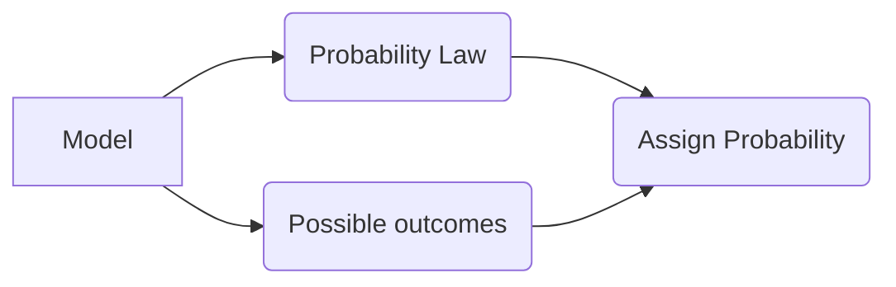

# Website

This website is built using [Docusaurus](docusaurus), a modern static website generator.

## First steps

To configure and run locally you need to install [node](node). Node installation comes with a _package manager_ `npm`. 

> When installing Node.js, you are recommended to check all checkboxes related to dependencies.

Docusaurus consists of a set of `npm` packages.


## Installing docusaurus and website

To install docusaurus **locally** we will use the command `npx`. 

The following steps require you to have the URL of this repository. Go to the folder where you will have this repository, say `Documents`, open the terminal and type

```
npx create-docusaurus@latest
```
It will prompt you for the name of the `website`, the name you type in here will be the name of the folder that will contain this repository.

Next, it will prompt you about a template, choose `Git repository`. When prompt you about the URL paste this repository's URL.

Next, choose `Deep clone` and that's it.

You will have a folder with the repository cloned and with the docusaurus packages.

### Website structure

Currently, a simplified version of the website structure is
```
my-website
├── blog
│   ├── 2019-05-28-resourcefulness.md
│   ├── 2019-06-29-the-diet-problem.md
│   └── 2019-06-02-the-simplex-algorithm.md
├── docs
|    ├───mip_go
|    │   ├───1_introduction
|    │   ├───2_documentation
|    │   ├───3_discover
|    │   ├───4_define
|    │   ├───5_develop
|    │   │   └───4_data_schema
|    │   └───assets
|    │       └───new_project
|    └───mip_opt
|        ├───1_introduction
|        ├───2_beginner_examples
|        ├───3_best_practices
|        ├───4_formulation_techniques
|        └───assets
├── src
|   ├── components
│   ├── css
│   │   └── custom.css
│   └── pages
│       ├── styles.module.css
│       └── index.js
├── static
│   ├── img
|   └── files
├── docusaurus.config.js
├── package.json
├── README.md
└── sidebars.js
```

What is important is the `docs` folder. Inside there are two subfolders: `mip_go` and `mip-opt`. Their internal structure resembles the sidebar of each subfolder, compare the folder structure and naming of `mip_go` with the Mip-Go sidebar


Each folder represents a section in the sidebar, so the folder `1_introduction` is the first section in the sidebar. Sections are expected to have articles, but also can contain subsections as for example subsection `Data Schema` in the section `Develop`. 

In the end, the real content will be in markdown files, the folder structure serves as a way to organize and _group_ the content. 

Inside each section there are several markdown files, each numbered accordingly to how it is expected to be displayed in the sidebar, following the naming convention of each file will help to know the structure of the sidebar as content creators. 

To let the docusaurus engine know the order of the elements in the sidebar you will add the front matter, at the top of each markdown file add
```
---
sidebar-position: 5
---
```

This will indicate to docusaurus to place the article at the position 5 in the section. 

Sections also need to be specified their order in the sidebar, for that, each section have a json file called `_category.json` where this is indicated as follows

```
{
  "label": "Develop",
  "position": 6,
  "link": {
    "type": "generated-index",
    "description": "Review of the development process."
  }
}
```
The only 3 things to change accordingly are `label` which is the displayed name of the section, `position` which place the section in relation with the other sections and `description` will add a description to the tab of the section.

### Assets

Folders `mip_go` and `mip_opt` have a subfolder called `assets` where images will be placed. To use an image from that folder use a relative path, see for instance
`\docs\mip_go\1_introduction\1_overview.md` to use an image in assets the relative path is `../assets/dwise.png`.

### LaTeX and mermaid support

Support for LaTeX and mermaid diagrams was added. For math equations use LaTex as usual, math equations are rendered using [KaTeX](katex).

If you need to add diagrams, [mermaid](mermaid) is a great tool, you can use their [live editor](mermaid_live_editor) to play with the diagrams before use them in the website. An example 


## Development stages

### Local Development

You can use either `npm` or `yarn` to start the server. If you installed node, then you can install `yarn`
```
npm install --global yarn
```

To start a local development server and have a preview of the website which opens up a browser window run

```
$ yarn start
```
Most changes are reflected live without having to restart the server.


### Build

```
$ yarn build
```

This command generates static content into the `build` directory and can be served using any static contents hosting service.

### Deployment

It is important to build the site first locally before deployed. Once the site have been locally and it is all good, make sure to push the changes to remote, specifically to the `main`  branch and next run the deployement command.

Using SSH:

```
$ USE_SSH=true yarn deploy
```

Not using SSH:

```
$ GIT_USER=<Your GitHub username> yarn deploy
```

If you are using GitHub pages for hosting, this command is a convenient way to build the website and push to the `gh-pages` branch.

[docusaurus]: https://docusaurus.io/
[node]: https://nodejs.org/en/download/package-manager
[katex]: https://katex.org/
[mermaid]: https://mermaid.js.org/intro/
[mermaid_live_editor]: https://mermaid.live/edit